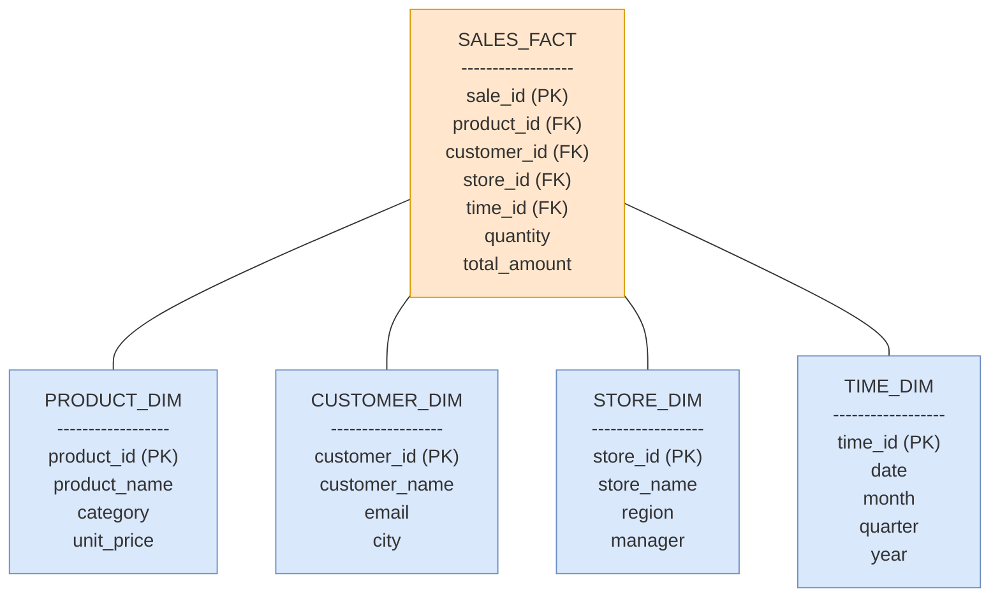
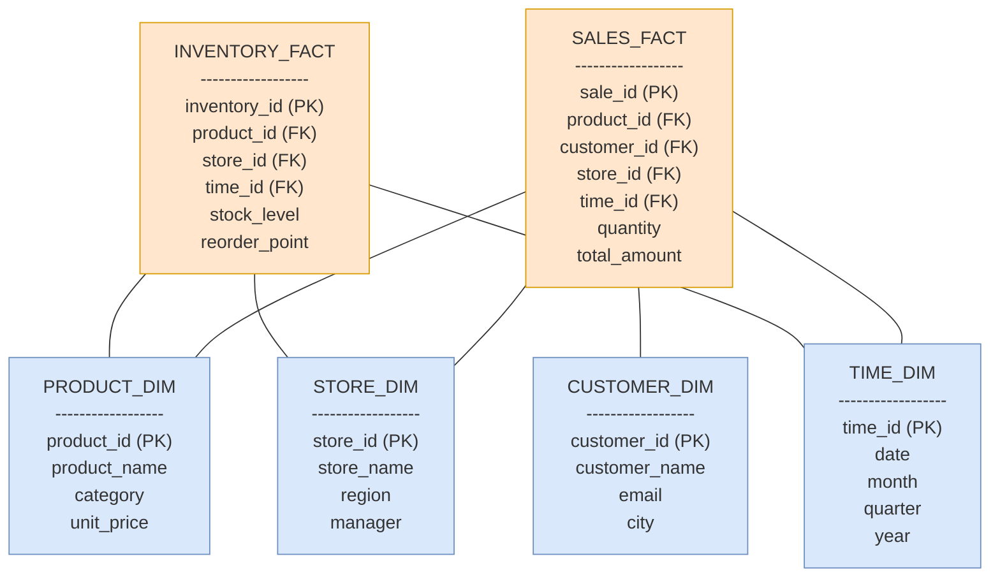

# Storage and Retrieval

## Data Structures that Power Your Database
There are three types of data structures that power databases:

1. **Log-Structured Storage**: an append-only storage engine that uses an append-only log file to store data sequentially. Log-structured storage is frequently paired with log-structured indexes, such as hash indexes and SSTables and LSM-Trees.
2. **Page-Oriented Storage**: a storage engine that organizes data into fixed-size blocks (pages). Page-oriented storage is frequently paired with B-Trees. B-Trees are more common in page-oriented storage because B-Tree nodes expect to be updated in-place (random access) as opposed to the append-only approach of log-structured storage.

Technnically, it is possible to mix and match storage engines and the index strategies above. However, it is not done in practice because each storage engine is optimized for its corresponding index strategy.

## Terminology and Concepts
- **Page**: a fixed-size block of data (usually 4KB or 8KB) stored on physical disk. Page-oriented storage and page-oriented indexes are based on pages. Log-structured *storage* at the physical level is eventually written at the page size (all data is), but it is called log-structured storage because the data is logically grouped into larger segments in a log file.
- **Segment**: a larger group of data in log-structured storage (typically in the MB range) that is written to disk at once.
- **Storage** is different from the **index**. Storage is the actual data stored on disk while the index is a data structure that maps keys to the corresponding record offsets in the storage engine.

## Log-Structured Storage
For log-structured storage, the database appends each record to a log file. An append-only log has higher storage requirements, but several benefits:
- It avoids concurrency issues associated with attempting to update a record that is being read by another process.
- It is easier to implement a crash recovery algorithm.

### Log-Structured Indexing
Naively scanning a database for a specific record is inefficient (O(n) time complexity). Instead, maintaining an index that maps keys to the corresponding record offsets in the log file is more efficient.

Log-structured indexes are indexing strategies that write data in an **append-only** manner and **avoid in-place updates**.

Note: Indexing can speed up reads if chosen correctly, but they will slow down writes.

There are several indexing strategies for log-structured storage:

#### Hash Indexes
The hash index approach maintains a hash table of key-value pairs. The keys are record values and the values are the record offsets, which is the offset distance where the record appears in the log file.

The hash table is maintained in memory for fast lookups. If the hash table is too large, disk space can be used, but is significantly slower and not feasible in practice. Logs are typically stored in **segment files**, which are immutable and append-only. Each segment maintains its own hash table.

**Compaction** is used to improve storage effiency. Compaction keeps only the most recent record key and ignores older duplicate keys. During the compaction process, segment files are merged when space is freed up from duplicate keys.
- Compaction happens in the background. While it occurs, the database serves reads using the old segment files.
- After compaction is complete, the old segment files are deleted and reads are served from the new segment files.

#### Sorted String Tables (SSTables) and Log-Structured Merge-Trees (LSM-Trees)

**Architecture**
In SSTables, the segment file format is modified. Key-value pairs are sorted by key. 
- Merging segments becomes faster since the keys are already sorted and takes on a mergesort approach.
- Locating a key no longer requires storing an index of *all* keys in memory since the keys are sorted. Instead, a  sparse index can be maintained and the key can be located by scanning for it in a range with a smaller key and larger key.

**SSTables** are stored on disk as an immutable, outside of the compaction process, read-only segment file. **Memtables** are functionally equivalent, but are stored in memory for faster reads and *writes*. When a memtable is full, it is flushed to disk and referred to as an SSTable.

Trees are used to maintain sorted order.
- **B-Trees** can be used but are not used as a log-structured index.
- **Binary Search Trees (BSTs)** such as **Red-black trees** or **AVL trees** are used as log-structured indexes. Red-black trees and AVL trees maintain a balance between the left and right subtrees.
    - Red-black trees
        - Red-black trees color the root node black and color the children red. 
        - Nodes are initially colored red when inserted. 
        - Red nodes cannot have red children. 
        - Each path from a node to its descendant null pointers (leaves) has the same number of black nodes.
        - Nodes are recolored or rotated to maintain the tree's properties.
        - Limited to 2 children per node.
    - AVL trees
        - AVL trees requires nodes to maintain a balance factor equal to -1, 0, or 1 between the left and right subtrees. The balance factor is the difference in height between the left and right subtrees.
        - Nodes are rotated to maintain the tree's properties.
        - AVL trees are more strictly balanced at the expense of more rotations.
        - Limited to 2 children per node.

**Queries**
When querying, the memtable is checked first. If the key is not found, each SSTable is checked. 

**Bloom filters** can be created for each SSTable to quickly filter out keys that are not in the SSTable. 
- Bloom filters are probabilistic data structures that allow for fast lookups. 
- Raw values are hashed and stored in a bit array. 
-Bloom filters have a nonzero false positive rate from hash collisions, but a zero false negative rate; a lookup guarantees that a key is either not present if it is not in the bloom filter or potentially present if it is in the bloom filter. 

**Compaction**
Compaction is used to merge SSTables and memtables. 
- Compaction strategies include **size-tiered** and **leveled** compaction. 
    - Size-tiered compaction merges SSTables by size. 
    - Leveled compaction merges SSTables by level. 
- Compaction is performed in the background. 
- While compaction is occurring, the database serves reads using the old SSTables and memtables. 
- After compaction is complete, the old SSTables and memtables are deleted and reads are served from the new SSTables and memtables. 

### B-Trees
B-Trees are the standard indexing strategy for most relational databases. They are also used in some NoSQL databases.

#### B-Tree Properties
B-trees are trees with the following properties:
- B-trees are balanced: the number of keys in each node is at least half full.
- B-trees are ordered: keys are sorted in ascending order.
- Each child node, except for the root and leaf nodes, has at least *m/2* keys where *m* is the maximum number of children per node.
- Each internal node has at most *m* children and *m-1* keys.
- Each leaf node has at most *2m* keys. Data is stored in leaf nodes while keys with references to child nodes are stored in internal nodes.
- The root node has at least 2 children.
- All leaf nodes are at the same depth.

#### Operations

As opposed to log-structured indexes, B-Trees (1) perform **in-place** updates, (2) do not perform compaction, and (3) are optimized for minimizing reads and writes rather than write-heavy workloads.

- B-Trees keep key-value pairs in sorted order but are otherwise structurally different from BSTs.
- B-Trees break databases down into small fixed-size **blocks** (aka **pages**) on the order of 4KB. Log-structured indexes use larger variable-size segments on the order of several megabytes.
- B-tree nodes can have multiple children.

#### B-Tree Architecture
Each page can be identified by an address or location, similar to a pointer in memory except all data occurs on disk. Pages reference other pages to maintain the B-Tree structure. 

A page with only individual keys is referred to as a **leaf page**. The number of references to child pages is referred to as the **branching factor**. Increasing the branching factor reduces the depth of the tree, which reduces the number of disk reads and writes.

**Updates**
Updating a value involves searching for the relevant leaf page, updating the value, and then writing the page back to disk. 

**Inserts**
Inserting a new value involves searching for the relevant leaf page, inserting the value, and then writing the page back to disk. If there is insufficient space, the page is split into two half-full pages.

#### Optimizations
Since B-trees use in-place updates instead of append-only logs, there are potential crash recovery and concurrency issues. 

**Crash Recovery**
B-trees use **write-ahead logging** (**WAL** or **redo log**) to support recovery from crashes. The WAL is an append-only file that all updates are written to before being applied to the tree. 

**Concurrency Control**
If multiple threads will access the B-tree simultaneously, a **latch** (lightweight lock) is used to ensure that only one thread can access the B-tree at a time. 

B-trees can also use **MVCC** (**Multi-Version Concurrency Control**) to support concurrency control. Each update creates a new version of the tree and the old version is kept until it is no longer needed. 

### B-Trees vs. LSM-Trees
- B-Trees are optimized for read-heavy workloads because of their in-place updates and lack of compaction.
- LSM-Trees are slower for read-heavy workloads because of the need to scan multiple SSTables at different stages of compaction.
- B-Trees are less optimized for write-heavy workloads because their in-place updates require writing to both the WAL and B-Tree.
- LSM-Trees are optimized for write-heavy workloads because of their append-only logs. However, a write in a LSM-Tree can trigger additional writes for compaction. 

A single write that triggers multiple writes is known as **write amplification**. B-Trees suffer from it because of (1) the need to write to both the WAL and B-Tree, (2) the need to split pages when they are full, and (3) the need to rebalance the tree when a node is split. LSM-Trees suffer from it because of the need to compact SSTables.

### Values of Indexes
The value associated with an index key can either be (1) the actual data row (document, vertex, etc.) or (2) a reference to the data row. 

For (1), the data can be stored in the same location as the index, which becomes known as a **clustered index**. MySQL's InnoDB storage engine uses clustered indexes with the primary key as the clustered index and secondary indexes as references to the primary key.

For (2), the data can be stored in a **heap file**. 
- Heap files can be an append-only log or it may keep track of deleted rows and overwrite them with new data later. 
- The heap file approach avoids duplicating data when multiple secondary indexes reference the same data row since the actual data remains in the same location.
- Updates can be handled in-place. If the new value is larger than the old value, either (a) all the indexes pointing to the heap can be shifted or (b) the old index can be updated to become a forwarding pointer that points to the new location for the new value.

A compromise between (1) and (2) is to use a **covering index** (aka **index with included columns**). Some table columns are included in the index while others are stored in the heap file. Covering indexes can speed up reads but will slow down writes.

## Other Indexing Structures

### Secondary Indexes
Secondary indexes are additional indexes **without** a uniqueness guarantee that are used to  support efficient joins. For example, a user_id column to allow retrieval of all rows relevant to a unique user.

### Index Value Storage
Indexes are the keys that queries search for. Their values can either be (1) a reference to the row (stored elsewhere) or (2) the row of data they correspond to.

#### Reference Approach (Nonclustered Index)
The reference approach stores row data in an unordered **heap file** and indexes reference the heap file location. Heap files can be append-only or with deleted row tracking to support overwriting deleted row locations with new rows later.

**Advantages**
- Avoids duplicating data when multiple secondary indexes are present. Each secondary index references the same location in the heap file and the data is kept in the same place.
- Efficient updates **if** new values are not larger than the old values. 

**Disadvantages**
- Slower updates **if** new values are larger than old values and exceed the heap space allocated to the old values. Larger new values may require finding a new heap file location with sufficient space. Using a new location requires (1) updating any indexes with references to the old file to reference the new file or (2) leaving a forwarding pointer in the old heap file location.
- Performance penalty from extra hop from index to heap file location.

#### Direct Storage (Clustered Index)
The clustered index approach directly stores the indexed row within the index. 
- MySQL's InnoDB engine treats primary keys as clustered indexes; secondary keys reference the primary keys for data.
- SQL Server supports specifying one clustered index per table

#### Hybrid (Covering Index)
Covered indexes are a compromise between nonclustered and clustered indexes. **Some** columns are stored directly within the index while the remaining ones are referenced. Queries that can use the index alone are said to be **covered by the index**.

### Multi-Column Indexes
Mult-column indexes enable efficient queries that depend on filtering across multiple columns simultaneously, such as geospatial data. A common approach is to create a **concatenated index** that combines the values of the relevant columns. Specialized approaches, such as R-trees for geospatial indexes, have been created for specialized domains.

### Fuzzy Indexes
Fuzzy indexes are used for partial or similar matcheskeys, such as full-text search engines. Lucene uses a SSTable-like structure for a dictionary of similar words

### In-Memory Databases
In-memory databases, such as VoltDB, MemSQL, and Redis, offer faster performance for lower durability. The performance advantage of in-memory databases interestingly comes from avoiding the need to encode data in a manner that disk-based storage can use.

Some in-memory databases are simple key-value stores (Redis and Memcached) while others are full relational databases (VoltDB and MemSQL).

## Database Use Cases
The choice of database technologies depends on the processing and data characteristics. Use cases can roughly be split into the following categories:

1. Online Transaction Processing (OLTP): Traditional source of record use case for processing transactions.
2. Online Analytic Processing (OLAP): Analytics using aggregate statistics over large number of records.
3. Data Warehouse: A read-only copy of a OLTP that analysts can use for granular queries without impacting the production OLTP.
4. Data Lake: A centralized repository that holds any data that might be useful for analysis. Data lakes are formed by ETLing data from other sources in a raw format (i.e., data lakes do not impose strict data structures or file types). 
5. Data Lakehouse: A combination of data lake and data warehouse capabilities. Data lakehouses support queries by adding transaction layer and schema enforcement on top of data lake storage. Data lakehouses can have different zones with different schema enforcement.
6. Data Marts: A subset of data warehouse data for providin a more tailored and limited set of data to targeted teams.

### Data Warehouse Schemas
Data warehouse schemas typically fall into the (1) star, (2) snowflake, and (3) galaxy pattern. The primary components are a single **fact table** that contains foreigns keys that reference **dimension tables**. Fact tables typically track events and contain a combination of simple flat data about the event and references to dimension tables for more complex data.

#### Star Pattern
Star pattern data models have one fact table that references a single layer of dimension tables.

Star data model example

#### Snowflake Pattern
Snowflake pattern data models follow the star pattern, but dimension tables will reference additional layers of dimension tables.

    
Snowflake data model example

#### Galaxy Pattern
Galaxy pattern data models have multiple fact tables that may reference common or independent dimension tables (e.g., a galaxy with multiple star systems). 

Galaxy data model example

## Column Oriented Storage
Column oriented storage focuses on analytic loads by storing the values from a column together. This approach optimizes for analytic loads because those queries typically focus on running statistics that requiring aggregation over a column. In contrast, most traditional transactional tasks focus on modifying a single entry that includes many different columns.

### Storage Process
Column oriented storage leverages SSTables and the LSM-tree approach. Each SSTable holds one or more columns. When the SSTable is flushed to long-term storage, it is added to the highest level of the LSM-tree. Periodically, the tree is compressed.

### Column Compression
Column oriented storage is further streamlined through compression. The number of distinct values in a column is typically small compred to the number of rows.

If there are `m` rows with `n` distinct values
- Each unqiue value maintains a bitmap for whether the value occurs in the row.
- This results in `n` bitmaps with `m` values.
- Bitmaps that are mostly zero are referred to as **spare**.

Bitmaps are efficient because they are suited to many filters. For example, finding the how many times a set of values occurs in a column requires can be simply done by combining the different bitmaps with a bitwise OR and counting nonzero entries. Alternatively, finding how frequently one value occurs in one column while another value occurs in a second column involves AND-ing the two columns and counting nonzero entries. This type of bitwise processing is known as **vectorized processing**.

### Writes to Columns
Column oriented storage cannot be updated in place easily because rows are identified based on their position in a column file and column comprehension means multiple updates are required to reflect a single value update.

For example, inserting a row in the middle of a sorted table means each column file would need to be updated. Separately, updating one value would involve updating multiple bitmaps in a compressed column.

Note: Modern column stores now include an index that maps the primary keys of rows to their positions in the column. 