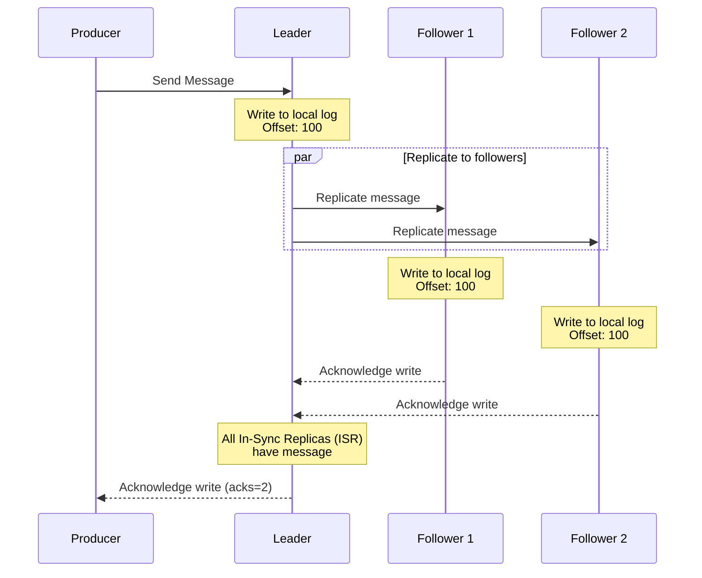

# Apache Kafka
Kafka is a message broker that provides pub/sub capability. **Producers** publish messages to **topics** that **consumers** subscribe to. 

## Architecture
Kafka is composed of **brokers** that manage the storage and retrieval of messages. The overall health of the Kafka cluster is maintained by **controller brokers**. Controllers monitor the health of brokers and other controllers.

### Data Plane
Topics are divided into one or more **partitions**. Each partition holds a portion of the topic data. Partitioning allows Kafka to scale horizontally by distributing data across brokers. There are three partitioning strategies:
- The default partitioner uses a round robin strategy for distributing messages between partitions. 
- Key-based partitioning assigns messages with the same key to the same partition.
- Custom partitioning uses a custom method to manually assign each message to the relevant partition.

Each partition can have multiple **replicas**; each replica is stored on a different broker. Replicas enable resilience and allow producers and consumers to fail over to backup copies if one fails. One replica is elected as the **partition leader** by the active controller. **Follower partitions** are the remaining replicas that serve as backups if the partition leader fails. All messages are first written to the partition leader. The partition leader forwards the message to its follower partitions for replication. The partition leader can, optionally based on the `acks` policy, inform the producer that the message has been successfully saved.
Each partition can have multiple **replicas**; each replica is stored on a different broker. Replicas enable resilience and allow producers and consumers to fail over to backup copies if one fails. One replica is elected as the **partition leader** by the active controller. **Follower partitions** are the remaining replicas that serve as backups if the partition leader fails. All messages are first written to the partition leader. The partition leader forwards the message to its follower partitions for replication. The partition leader can, optionally based on its acknowledgment policy, inform the producer that the message has been successfully saved.

### Control Plane
One controller, the **active controller**, is responsible for monitoring the health of brokers and electing partition leaders. The remaining controllers serve as backups. Communication between controllers is managed using the **KRaft (Kafka Raft)** protocol. Under KRaft, all controllers maintain an in-memory metadata cache that allows them to communicate with other controllers and elect a new active controller if the current one fails.

## Message Flow

Producers send messages to a topic. The receiving broker determines which broker is the leader for the relevant partition and forwards the message to that broker. The broker for the partition stores the message in its partition and waits for it to be replicated across other partitions.

